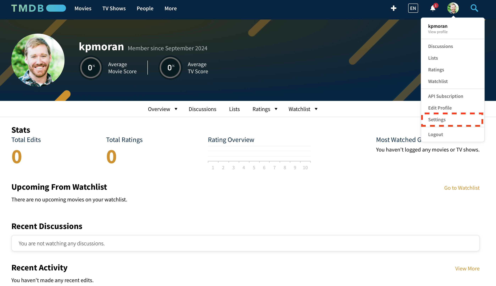
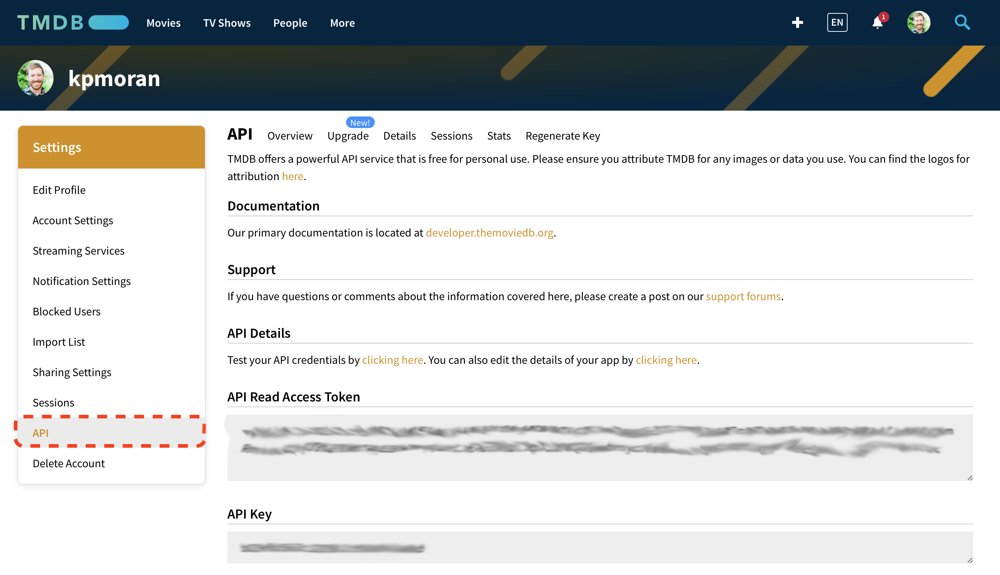
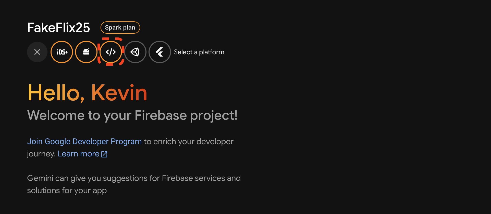
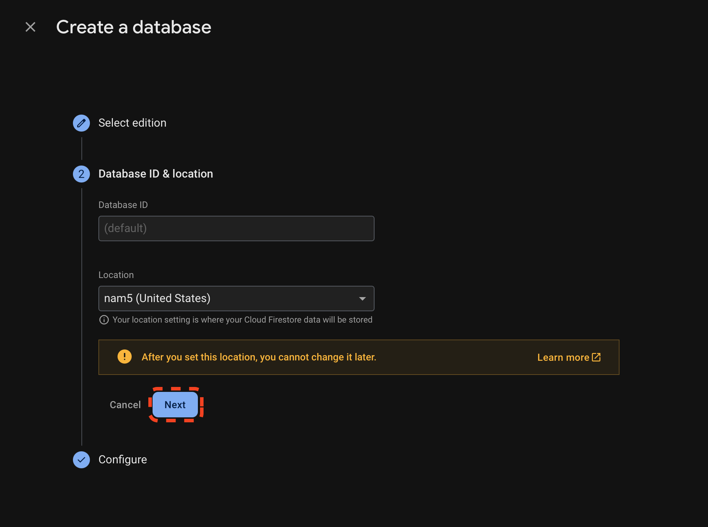
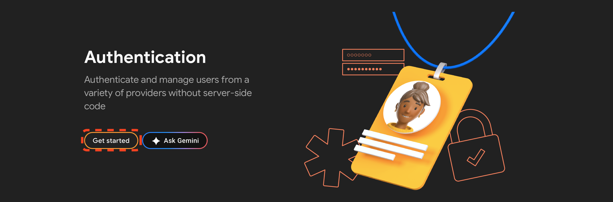
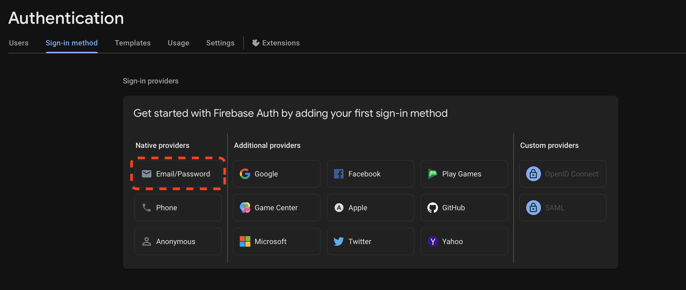

<a href="https://fakeflix.th3wall.codes">
  
  <h1 align="center">Fakeflix</h1>
</a>

<p align="center">
  Not the usual clone that you can find on the web.
</p>

<p align="center">
  <a href="#-about"><strong>About</strong></a> ·
  <a href="#%EF%B8%8F-demo"><strong>Demo</strong></a> ·
  <a href="#sparkles-features"><strong>Features</strong></a> ·
  <a href="#rocket-technologies"><strong>Technologies</strong></a> ·
  <a href="#-screenshots"><strong>Screenshots</strong></a> ·
  <a href="#-run-locally"><strong>Run Locally</strong></a> ·
  <a href="#white_check_mark-requirements"><strong>Requirements</strong></a> ·
  <a href="#-license"><strong>License</strong></a>
  <a href="#-Testing"><strong>Testing</strong></a>
</p>
<br/>

https://user-images.githubusercontent.com/25078541/123811962-01474580-d8f4-11eb-83ba-66cded3f321f.mp4

<br/>

## 🎯 About

The Web App redirects you to an authentication page, in which you can choose to sign up or to sign in: you can sign in with your custom account or with your Google account. Once you are logged in and after the splash animation, you will land on the homepage, in which you can find a mix of movies and series divided into rows.<br/>
Each row represents a movie/series category: you can click on it and you will be redirected to the selected category, a page that loads thousands of movies with an infinite scroll. You can also navigate to the movies page, series page, new & popular page (that contains the upcoming movies/series and the most popular ones) or you can navigate to your favorites page.<br/>
You can add/remove movies/series through the plus and minus buttons that you can find hovering each poster or opening a single movie's detail modal. If you click on the play button you can enjoy a custom CSS-only play animation with Fakeflix's brand name.<br/>
You have also the option to search through TMDB's catalogue using the search functionality inside the fixed navbar: you can search by movie name, actor or movie director.<br/><br/>

<br/>

## :sparkles: Features

:heavy_check_mark: &nbsp;&nbsp;Display movies and series, old and upcoming, also from the real Netflix<br />
:heavy_check_mark: &nbsp;&nbsp;Category related page with infinite scroll<br />
:heavy_check_mark: &nbsp;&nbsp;Search by title, actor, movie director<br />
:heavy_check_mark: &nbsp;&nbsp;Add/Remove to/from "My list" functionality<br />
:heavy_check_mark: &nbsp;&nbsp;Detail modal with extra informations about the selected movie/series<br />
:heavy_check_mark: &nbsp;&nbsp;Customized splash animation (credits: [Claudio Bonfati's pen](https://codepen.io/claudio_bonfati/pen/mdryxPv)) with characteristic Netflix sound<br />
:heavy_check_mark: &nbsp;&nbsp;Play animation with characteristic Netflix sound<br />
:heavy_check_mark: &nbsp;&nbsp;Google login<br />
:heavy_check_mark: &nbsp;&nbsp;User Sign In & User Sign Up<br />
:heavy_check_mark: &nbsp;&nbsp;Use of React hooks and custom hooks<br />
:heavy_check_mark: &nbsp;&nbsp;Favourites list persistence (session storage)<br />
:heavy_check_mark: &nbsp;&nbsp;Responsive layout<br />
:heavy_check_mark: &nbsp;&nbsp;Swipeable movies list<br />
:heavy_check_mark: &nbsp;&nbsp;Loading skeletons<br />
:heavy_check_mark: &nbsp;&nbsp;Route animations and micro-interactions (handled with Framer Motion)<br />

<br/>

## :rocket: Technologies

- [TMDb API's](https://www.themoviedb.org/)
- [React](https://reactjs.org/)
- [React Hooks](https://reactjs.org/docs/hooks-intro.html)
- [React Hooks Form](https://react-hook-form.com/)
- [React Router](https://reactrouter.com/web/guides/quick-start)
- [Redux](https://redux.js.org/)
- [Redux Thunk](https://github.com/reduxjs/redux-thunk)
- [Redux Saga](https://redux-saga.js.org/)
- [Redux Persist](https://github.com/rt2zz/redux-persist)
- [Redux Logger](https://github.com/LogRocket/redux-logger)
- [Reselect](https://github.com/reduxjs/reselect)
- [Firebase](https://firebase.google.com/)
- [SCSS](https://sass-lang.com/)
- [SwiperJS](https://swiperjs.com/react)
- [Framer Motion](https://www.framer.com/motion/)
- [React Icons](https://react-icons.github.io/react-icons/)
- [Netlify](https://www.netlify.com) (have a look below) and [Vercel](https://vercel.com/) for the deploy and CI.

## 📸 Screenshots

**Sign In**

<br/>

**Sign Up**

<br/>

**Homepage**

<br/>

**Modal Detail**

<br/>

**Mobile Experience**

https://user-images.githubusercontent.com/25078541/123543831-b8a35700-d750-11eb-84dc-b53e5a9a997a.mp4

<br/>

**Desktop Experience**

https://user-images.githubusercontent.com/25078541/123811962-01474580-d8f4-11eb-83ba-66cded3f321f.mp4

<br/>

## 👨🏻‍💻 Run Locally

The following commands should be executed in the terminal. These were tested with the `bash` shell, although the `zsh` shell should also function properly.

1. Clone the project

```bash
  git clone https://github.com/UCF-CEN-5016/Fakeflix-UCF-F25
```

2. Navigate into the project directory

```bash
  cd fakeflix
```

3. Install dependencies using the Node Package Manager

```bash
  npm install
```

4. Create a `.env` file

```bash
  touch .env
```

5. Next, we need to get an API key so that FakeFlix can download movie data to dsiplay in the app. We will be using a website called TMDB to accomplish this. Navigate to [The Movie Database (TMDB)](https://www.themoviedb.org/?language=en-US) and sign up for a free account. You can do this by clicking on the menu option highlighted in red in the screenshots below. When asked for the registration reason, you can state that you are learning React programming for a university class.






6. After registering for the API, Navigate to the API settings page that contains your API key, as illustrated below. Copy the "API Key", you will not use the "API Read Access Token".


7. Next, open your `.env` file that you created in Step 4 (you may need to enable your file explorer to show hidden files) and add the lie below, replacing the right hand side with the TMDB API key that you copied. Save the File and move onto the next step.

```
REACT_APP_API_KEY=TMDB_API_KEY
```

8. Fakeflix uses the Firebase service's real-time database and cloud authentication features to enable sign ups and persist user data across sessions. To get the app to work properly, you will need to sign up for a Firebase account and enable these features. First, navigate to the Firebase website, and sign up for a free account. Then, create project called "FakeFlix" as shown below:


On the next screen, you can enable the Google Analytics and click "continue" as shown below.


When asked to configure the account for Google Analytics, you can use the default account, as shown below.


Within your Firebase project, create a webapp by clicking on the Icons as indicated below:




Call your webapp "FakeFlix", do not enable hosting, and then click on the "Configure App" button, as shown below.


The next screen will show the API configuration for your app. Copy the Firebase Configuration text as shown below and paste in a temporary text file, we will come back to this information later. Finally, click on the "Continue to Console" button.


Once you are back at the Firebase project console screen, it's time to enable the FireStore database. Open the "Build" menu on the left-hand side of the screen and then click on the "Firestore Database" option, as shown below.


On the next page, click on the "Create Database" button, as shown below.


The page below may or may not be shown to you depending on your Google Account, if it is shown, just select the "Standard Edition" option. If it is not shown, skip to the next step.


On the first configuration screen, leave all of the settings as default and click on the "Next" button, as shown below.



On the second configuration screen, be sure to change the database mode from "production mode" to "test mode" as shown below. Then click on the "Create" button. It will take a few minutes for Firebase to provision the database. 


Now that the Firestore database has been provisioned, we need to enable user authentication. To do this, go back to the Firebase console, open up the left-hand menu, and click on the "Authentication" option, as shown below.


On the next screen, click on the "Get started" button to set up user authentication, as shown below.



On the resulting configuration screen, click on the option for "Email/Password", as shown below.



On the second configuration screen, ensure that both options for "Email/Password" and "Password-less Link" are **both** enabled, as shown below.


Your Firebase account is now completely configured, and you can finish setting up your app!

9. Next, take the Firebase configuration that you copied earlier, and format as shown below, and insert this into your `.env` file underneath the line that contains your TMDB API key.

```
REACT_APP_FIREBASE_API_KEY=REACT_APP_FIREBASE_API_KEY
REACT_APP_FIREBASE_AUTH_DOMAIN=REACT_APP_FIREBASE_AUTH_DOMAIN
REACT_APP_FIREBASE_PROJECT_ID=REACT_APP_FIREBASE_PROJECT_ID
REACT_APP_FIREBASE_STORAGE_BUCKET=REACT_APP_FIREBASE_STORAGE_BUCKET
REACT_APP_FIREBASE_MESSAGING_SENDER_ID=REACT_APP_FIREBASE_MESSAGING_SENDER_ID
REACT_APP_FIREBASE_APP_ID=REACT_APP_FIREBASE_APP_ID
REACT_APP_FIREBASE_MEASUREMEMT_ID=REACT_APP_FIREBASE_MEASUREMEMT_ID
```

10. Finally, you can start the server! Running the command below should compile and run the app, opening the app in your browser window.

```bash
  npm start
```

<br/>


## :white_check_mark: Requirements

Before starting :checkered_flag:, you need to have [Git](https://git-scm.com) and [Node](https://nodejs.org/en/) installed.

<br/>

## 🧪 Testing

To run the project linter, run:

```bash
  npm run lint
```

To run the jest test suite, run:

```bash
  npm test
```

## 📝 License

[MIT](https://github.com/Th3Wall/Fakeflix/blob/main/LICENSE)

<br/>

